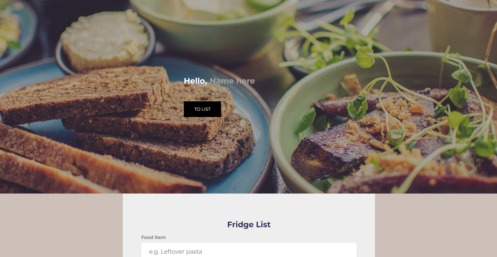
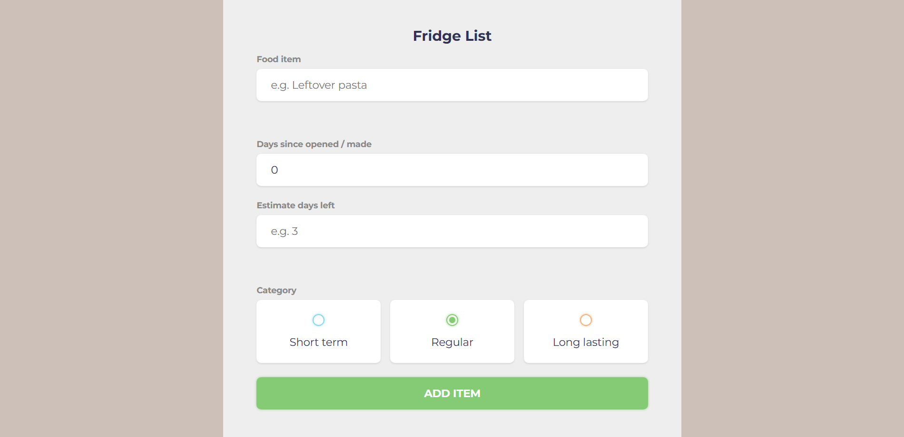
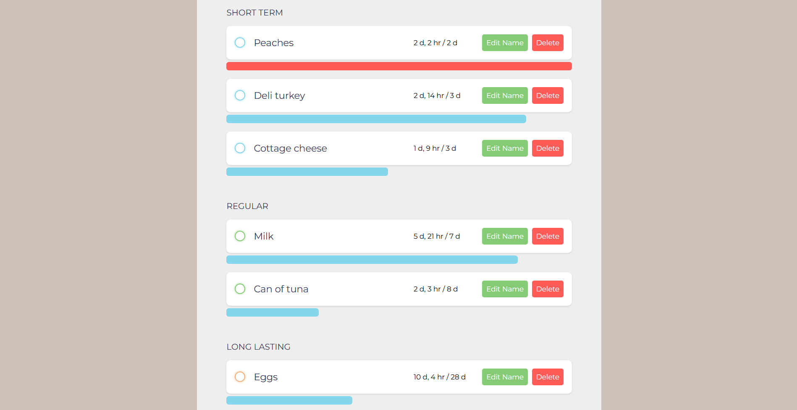

# FridgeListAndTimer

## Project Overview
FridgeListAndTimer is a simple and user-friendly web app that helps users keep track of food items in their fridge and monitor their freshness. It was built with the goal of making the state of urgencies of the food as immediately visually intuitive as possible. The app allows users to categorize items by shelf life, track how long they've been open, and estimate when they will expire. Built for anyone who wants to reduce food waste and manage their groceries efficiently, it requires no backend or account—everything is stored locally in your browser.

Standout features include a clean, responsive UI, persistent data storage using localStorage, and a visual progress indicator for each item's freshness. The project is ideal for students, families, or anyone looking to organize their fridge contents with minimal hassle.

## Features
- Clean, responsive interface
- Personalized greeting with persistent username

- Add, edit, and delete food items with custom names and categories
- Three customizable categories: Short term, Regular, and Long lasting

- Track days since opened/made and estimate days left for each item
- Visual progress bars indicate freshness and urgency
- Items are sorted based on calculated urgency

- All data is saved locally; no sign-up or backend required

## Tech Stack
- HTML5
- CSS3 (custom styles, responsive design)
- JavaScript (ES6, DOM manipulation, localStorage)

## Setup Instructions
1. Clone or download this repository to local machine.
2. Ensure all files (`index.html`, `main.css`, `main.js`, `food1.jpg`) are in the same directory.
3. Open `index.html` in web browser.

No additional setup or dependencies are required.